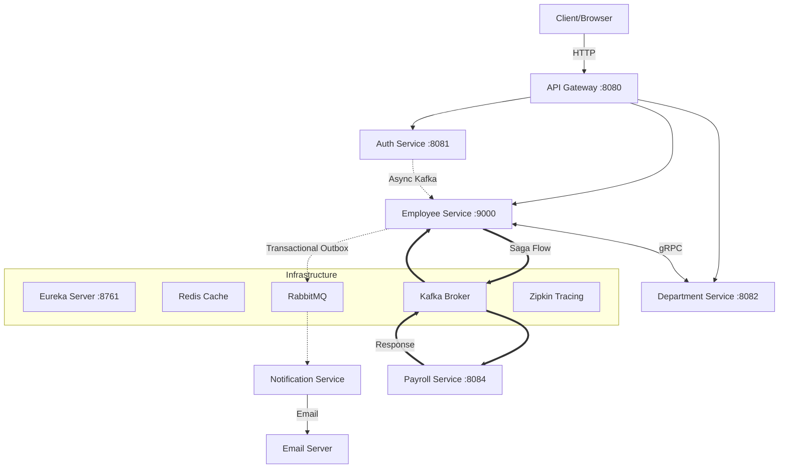

# Employee Management System (EMS) - Microservices

A robust, production-grade Employee Management System built with Java 17, Spring Boot 3, and a modern microservices architecture. This project demonstrates advanced distributed systems patterns including Saga, Transactional Outbox, and gRPC.

## 🚴🏾🚴🏾🚴🏾 In Progress… System Architecture Missing
1. Payroll will be added later 
2. K8s
3. Saga Flow

## 🏗 System Architecture



## 🛠 Tech Stack

- **Framework**: Spring Boot 3.3.5, Spring Cloud 2023.0.3
- **Language**: Java 17
- **Communication**: 
  - **REST**: External & Internal API calls (Feign)
  - **gRPC**: High-performance internal service-to-service communication
  - **Kafka**: Asynchronous event-driven flows (Saga Pattern)
  - **RabbitMQ**: Reliable messaging (Transactional Outbox Pattern)
- **Data**: PostgreSQL (Database per service), Redis (Distributed Caching)
- **Observability**: Zipkin (Distributed Tracing), Spring Actuator, Micrometer
- **Deployment**: Docker Compose, Kubernetes (Kustomize)

## 📦 Services Overview

1.  **API Gateway**: Central entry point. Handles routing, rate limiting (Redis), and JWT authentication.
2.  **Auth Service**: Manages user accounts, login, and token generation. Uses Kafka to notify Employee service.
3.  **Employee Service**: The core domain service. Implements **Transactional Outbox** for consistency and **Saga** orchestration.
4.  **Department Service**: Manages department data. Provides a **gRPC server** for Employee service.
5.  **Payroll Service**: Participates in the **Saga flow** to automatically provision payroll for new employees.
6.  **Notification Service**: Consumes RabbitMQ messages to send registration emails.
7.  **Eureka Server**: Service discovery registry.
8.  **Shared Module**: Common DTOs, Exceptions, and gRPC Proto contracts.

## 🚀 How to Run Locally

### Prerequisites
- Docker & Docker Compose
- Java 17 (if running without Docker)
- Gradle 8.x

### 1. Build the project
From the root directory:
```bash
./gradlew clean build -x test
```

### 2. Run with Docker Compose
This will spin up all microservices and infrastructure (Postgres, Kafka, etc.):
```bash
docker compose up --build
```
Access the system via the API Gateway at `http://localhost:8080`.

### 🚴🏾🚴🏾🚴🏾 Loading...  3. Run with Kubernetes  🚴🏾
If you have a k8s cluster (Minikube/Docker Desktop):
```bash
kubectl apply -k k8s/
```

## 🔐 Security
- **JWT**: Tokens are issued by Auth Service and validated at the Gateway.
- **BCrypt**: Passwords are encrypted before storage.
- **Resource Protection**: Internal APIs (like verification) are isolated or protected via filters.

## 📈 Distributed Patterns Applied
- **Saga Pattern (Choreography)**: Ensures data consistency across Employee and Payroll services using Kafka.
- **Transactional Outbox**: Guarantees that database updates and message publishing are atomic.
- **Circuit Breaker (Resilience4j)**: Handles failures in downstream services gracefully.
- **Database per Service**: Ensures loose coupling and independent scalability.
